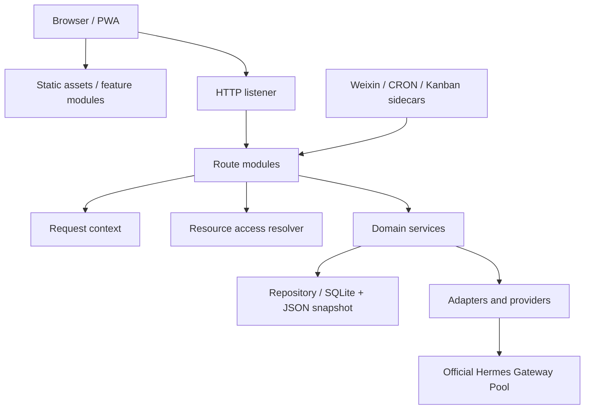

# Hermes Mobile 架构重构计划

最后更新：2026-05-14

## 1. 文档范围

本文是 Hermes Mobile 的正式架构重构计划，依据当前 `docs/HERMES_MOBILE_OVERVIEW_DESIGN.zh-CN.md`、`.agent-context/HANDOFF.md` 和本次用户要求的重构清单编写。它只记录架构目标、阶段拆分、模块边界、迁移顺序、风险控制和验收门槛。

本文不记录 raw secrets、Access Key、Gateway API key、OAuth token、VAPID private key、push endpoint、worker manifest secret、生产日志、用户聊天内容、上传文件内容、测评题目或答案。

## 2. 当前问题摘要

当前系统边界已经明确：Hermes Mobile 是产品调度、权限、状态和移动端体验层；官方 Hermes Gateway 是模型运行、Agent loop、工具调用、Skill、记忆、会话和 artifact 语义的执行内核。Adapter 层已经覆盖认证、工作区、权限、Gateway Pool、Kanban、Automation、Weixin、SQLite 等多个部署差异。

主要重构压力集中在以下方面：

- `server.js` 仍然同时承担 HTTP route、认证上下文、资源授权、业务编排、Gateway run、Web Push、Weixin、Kanban/学习/测评流程和静态服务等职责。
- API route 以大型顺序条件分支为主，缺少可独立测试、可组合的 router 边界。
- 认证、workspace、Owner 提权、请求体解析、审计字段、错误响应和资源 ACL 在多个路径上重复处理。
- 文件、artifact、Automation deliverable、Kanban output、shared directory 等资源访问规则需要统一 resolver，避免每类 API 自行解释路径和权限。
- Kanban/story/study/assessment 已经形成产品级工作流，但仍有较多逻辑散落在 `server.js` 和 `public/app.js`。
- SQLite 服务层已有基础，但部分运行时状态、sidecar metadata、读写仓储接口仍需要统一迁移策略和回滚策略。
- `public/app.js` 是大型单体前端，Kanban/story/study/assessment、Markdown、设置、聊天、目录等视图耦合较高。
- Markdown 渲染逻辑在前端阅读器、主应用和服务端外发转换中重复，样式和语义需要统一。
- 需要架构级测试覆盖 route 拆分、请求上下文、资源授权、SQLite parity、前端模块边界和 Markdown renderer 一致性。

## 3. 目标架构

目标不是重写产品，而是在保持现有行为和官方 Gateway 边界的前提下，把单体入口拆成可测试的层次化架构。

目标分层：

- HTTP listener：只负责创建 Node HTTP server、静态文件入口、统一错误兜底和 `/api/events` 等连接型入口。
- Route modules：按 API 面拆分为 auth/setup、owner/runtime、workspace/project、files/directories、threads/runs、push/realtime、todo/kanban、study/assessment、automation、weixin、skills。
- Request context：统一解析认证主体、workspace、Owner 权限、提权状态、URL/query、请求体、client version、审计字段和响应 helper。
- Resource access resolver：统一解析和授权 file、artifact、automation output、Kanban output、shared directory、upload、delivery 等资源。
- Domain services：承载业务用例，route 只做协议适配，不直接拼装核心流程。
- Repository/store：以接口隔离 JSON snapshot 与 SQLite；SQLite 逐步成为运行时主后端，JSON snapshot 保留为回滚和检查面。
- Adapters/providers：继续隔离官方 Gateway、Gateway Pool、Kanban CLI/bridge、Automation/CRON、Weixin sidecar、filesystem mount、runtime config 和外部集成。
- Frontend feature modules：把大型 `public/app.js` 拆为共享 shell、API client、state store、router、feature view 和 renderer。
- Shared Markdown renderer：统一 Markdown AST/HTML 渲染、转义、安全策略、阅读样式和外发导出策略。

## 4. 12 项重构工作包

### 4.1 `server.js` route 拆分

目标：把 `handleApi(req, res)` 的顺序分支迁移为显式 route registry。

边界：

- `server.js` 保留 listener、静态文件、SSE 长连接入口和 router 装配。
- 新增 `server/routes/*.js` 或等价目录，每个模块只注册本领域 route。
- 每个 route handler 接收 `ctx`，不直接重复解析认证、body、workspace 和错误响应。

优先拆分顺序：

1. setup/auth/public-config。
2. status/runtime-config/client-version/app-update。
3. push/Web Push receipt/delivery。
4. workspaces/access-keys/projects。
5. automation。
6. todo/kanban/study/assessment。
7. threads/messages/runs/uploads。
8. directories/files/artifacts。
9. weixin ingress/outbound/manual forward。

### 4.2 Request context

目标：建立每个 API 请求的规范上下文对象，避免 route 内部各自解释同一请求。

`RequestContext` 应包含：

- `requestId`、`method`、`url`、`pathname`、`query`。
- `auth`：当前主体、workspaceId、Owner 状态、Access Key 类型；不包含 raw key。
- `elevation`：Owner 限时 grant、一次性 token、消息级批准状态。
- `body` / `multipart`：按 route 需要惰性读取，限制大小和类型。
- `workspace` / `project`：经 provider 归一化后的当前工作区和项目视图。
- `audit`：非秘密审计字段，例如 route id、workspace id、资源类型、结果状态。
- `send` / `fail` helpers：统一 JSON、错误码、缓存头、安全头。

验收要求：所有用户可见 API 都通过 `RequestContext` 取得认证主体和 workspace，不再直接读取 cookie/header key 明文作为业务参数。

### 4.3 Resource access resolver

目标：集中处理所有资源定位、路径规范化和 ACL 判定。

resolver 覆盖：

- `/api/files` 与 `/api/files/preview`。
- `/api/directories/*`。
- `/api/artifacts/:id`。
- Automation output / deliverable / preview。
- Kanban output / detail output / document preview source。
- Study/reading submission artifacts 和 analysis output。
- Assessment exam/material/output。
- Group delivery、Weixin manual forward、shared directory。

resolver 输出应为结构化结果：

- `resourceType`、`resourceId`、`workspaceId`、`ownerWorkspaceId`。
- `resolvedPath` 或外部资源引用；返回给前端时必须转换为安全 public descriptor。
- `permissions`：read/write/delete/share/forward。
- `reason`：拒绝原因使用非秘密分类，不输出 raw path 细节给普通用户。

验收要求：route 不再自行判断“这个路径是否可读/可转发/可删除”，而是调用 resolver。

### 4.4 Chat/thread/run 服务化

目标：把 thread/message/run 队列、Gateway Pool 选择、SSE 事件、stop/liveness、usage/artifact 收集从 route 中剥离。

服务边界：

- `threadService`：thread CRUD、单窗口/group thread 选择、workspace 过滤。
- `messageService`：消息创建、附件、撤销、Owner approval rerun。
- `runService`：排队、并发判断、Gateway target 选择、stream 处理、stop/liveness。
- `artifactService`：artifact 归档、公开 descriptor、companion Markdown 发现。

约束：

- 普通 run 无健康低权限 worker 时必须 fail closed。
- Owner maintenance 只在显式授权下路由到高权限 worker。
- Gateway API key 只在内存请求中使用，不落库、不进日志、不进前端 payload。

### 4.5 Kanban/Todo 服务化

目标：把 `/api/todos` 兼容表面、官方 Kanban bridge、metadata sidecar、card detail、批量创建和动作变更合并为服务接口。

服务接口应覆盖：

- `listCards`、`getCardDetail`、`createCard`、`batchCreateCards`。
- `mutateCard`：complete/cancel/postpone/delete/block/unblock/comment/revise。
- `planCards`：Multi-Agent 拆解、reasoning effort、max parallel。
- `documentPreview`：DOCX/Markdown/text/CSV/JSON 输入预览。
- `reconcileDependencyBlocks` 和 card-list cache 刷新。

约束：

- 官方 Kanban 是执行内核，Hermes Mobile 只做移动端表面、workspace ACL、metadata 和工作流裁剪。
- 自然语言创建任务应走 Hermes Mobile API 和配置好的 worker wrapper，不直接写官方 Kanban 存储。

### 4.6 Story/study/reading/assessment 服务化

目标：把 story tree、study-plan、reading-plan、assessment-plan 从 UI 和 route 中抽成独立工作流服务。

服务边界：

- `storyService`：story grouping、collapse/archive、revision、story-level delete、single-card story。
- `studyPlanService`：周期卡创建、performer/viewer 角色、提交证据、AI 分析、quiz 状态。
- `readingWorkflowService`：录音提交、转写分析、针对性 quiz、canonical revision card、完成判定。
- `assessmentService`：正式测评计划、试卷生成、答题、评分、重考和完成判定。
- `caseShareService`：manager/performer/viewer 权限，不能只靠前端隐藏按钮。

验收要求：

- 学习/阅读/测评完成状态只信任 Hermes Mobile 的工作流状态和通过条件，不简单信任 raw Kanban `done`。
- shared viewer 只能读 story/card/output；performer 可提交和答题；manager 可管理计划和共享。
- 不在列表响应中暴露 raw transcript、模型分析全文、题目答案或用户提交正文。

### 4.7 SQLite 迁移和 repository 边界

目标：把运行时状态读写统一到 repository 接口，逐步让 SQLite 成为主后端，JSON snapshot 保留为回滚和检查面。

迁移对象：

- workspaces、access-key hashes。
- threads、messages、artifacts、usage。
- Web Push subscriptions、receipts、deliveries。
- shared directories。
- Todo/Kanban sidecar metadata、case shares、study/reading/assessment workflow state。
- Automation jobs、outputs index、audit events。

迁移策略：

- 先做双读校验和 dry-run 计数，不改变生产主读。
- 再做 SQLite 主写、JSON snapshot 后写，用 parity tests 验证。
- 再切换读路径到 repository，保留导出 JSON snapshot 的回滚能力。
- 最后清理直接读写 JSON 文件的业务路径。

约束：迁移报告只能输出计数、hash、大小、warning、integrity 状态和 schema version，不输出消息正文、用户内容、raw key、push endpoint 或私密路径。

### 4.8 前端模块化

目标：把 `public/app.js` 拆成可测试、可缓存、可按功能维护的模块。

建议边界：

- `app-shell`：启动、导航、全局状态、client-version、settings。
- `api-client`：统一 fetch、认证错误、JSON 错误、上传、SSE。
- `workspace-store`：当前 workspace、bindings、Owner 状态。
- `chat`：threads、messages、uploads、single-window、group chat。
- `kanban`：cards、story tree、composer、detail、outputs。
- `study`：study/reading submission、quiz、assessment exam。
- `files`：directory viewer、file preview、artifact links。
- `automation`：jobs、outputs、deliverables。
- `markdown`：共享 renderer、share/export UI。

迁移约束：

- 每次拆分必须保持旧入口和 Service Worker 版本策略可用。
- 移动端布局、字体偏好、PWA 安装、离线缓存和 deep link 不能回退。
- 前端权限隐藏只作为体验优化，服务端仍是唯一权限边界。

### 4.9 Markdown renderer 统一

目标：建立一个共享 Markdown 渲染与导出模块，替代 `public/app.js`、`public/file-viewer.html`、`server.js` 中重复的 Markdown inline/table/document renderer。

统一范围：

- 主应用内联 Markdown。
- 文件阅读器 Markdown preview。
- Markdown HTML export / print / Word-compatible export。
- Weixin manual forward 的 Markdown-to-PDF/HTML materialization。
- Group delivery 和 artifact companion Markdown preview。

安全与一致性要求：

- 默认转义 HTML，禁止未审计的 raw HTML 注入。
- 表格、task list、blockquote、code block、heading、list、link 在各入口语义一致。
- 移动端表格、长词换行、字体和字号偏好一致。
- 服务端导出和前端预览使用同一组 renderer fixture 验证。

### 4.10 Push/realtime/delivery 服务化

目标：把 SSE、Web Push、delivery receipt、deep link、Weixin outbound ack 统一为事件和交付服务。

边界：

- `eventService`：内部事件发布、SSE fan-out、client refresh signal。
- `pushService`：subscription、VAPID public key、receipt、delivery summary、test push。
- `deliveryService`：group delivery、Weixin forward、manual file forward、terminal status。
- `ingressService`：Weixin event 去重、heartbeat、attachment-only 等待、workspace 路由。

约束：

- Push payload 只放摘要和认证后可重新读取的定位信息。
- 外部 delivery ack 必须闭环到 `sent`、`failed` 或 `skipped`。
- Weixin ingress key 与浏览器 Access Key 分离，文档只记录配置名和路径策略。

### 4.11 架构级测试

目标：在单元测试之外增加能约束架构边界的测试。

测试类型：

- Route registry snapshot：所有 `/api/*` route 明确归属模块，无未登记分支。
- Request context invariants：认证、workspace、Owner 提权、body parsing、错误响应一致。
- Resource resolver tests：files/artifacts/automation/Kanban/shared directory 的读写删转发权限矩阵。
- Service contract tests：Kanban/story/study/assessment 服务不依赖 HTTP mock 才能运行。
- SQLite parity tests：JSON snapshot 与 SQLite export 的结构、计数和关键元数据一致。
- Markdown renderer fixtures：同一 Markdown 输入在前端预览、服务端导出、Weixin HTML/PDF materialization 中结构一致。
- Security invariants：普通 workspace 无法读其他 workspace、Owner maintenance 不会被普通 run 触发、secret 不进入 payload。
- Frontend module smoke：核心视图可独立加载并通过静态 marker 和 viewport tests。

### 4.12 发布、部署和隐私边界

目标：重构后仍满足产品化、生产部署和 public export 约束。

要求：

- `npm run productization:check` 继续作为合并前主门槛。
- `npm run privacy:scan` 覆盖新增目录和生成文件。
- Runtime package、mutable data、源码 checkout、Gateway profile 继续保持隔离。
- public export 不包含 `.agent-context`、runtime DB/state/logs/uploads/backups、secrets、私有路径或 worker secret manifest。
- 新增配置只记录环境变量名、非秘密说明和示例，不记录真实值。

## 5. 模块边界

| 层 | 允许职责 | 禁止职责 |
| --- | --- | --- |
| `server.js` | 创建 listener、装配 router、静态入口、SSE 连接兜底、统一错误兜底 | 业务规则、路径授权、Kanban/学习/测评流程、SQLite 细节、Gateway prompt 细节 |
| route module | HTTP 方法/path、参数映射、调用 context/resolver/service、返回响应 | 直接读写状态文件、直接拼接本地路径、绕过 service 调 Gateway |
| request context | 认证主体、workspace、Owner 提权、body/query、响应 helper、审计字段 | 存储 raw key、执行业务动作、打开任意文件 |
| resource resolver | 资源定位、路径规范化、ACL、public descriptor | 生成业务内容、改变工作流状态、暴露 raw secret/path |
| domain service | 业务用例、状态变更、工作流规则、调用 repository/adapters | 解析 HTTP cookie/header、输出前端 HTML |
| repository | SQLite/JSON 读写、迁移、事务、导入导出、计数和完整性 | 业务权限判断、Gateway 调用、模型提示词 |
| adapter/provider | 部署差异、外部系统、官方 Gateway/sidecar/bridge 边界 | 存储 raw secrets 到日志或前端响应、承担 UI 状态 |
| frontend module | 视图状态、渲染、用户交互、API client 调用 | 权限最终判断、隐式修改服务器状态、保存 raw secrets |

## 6. 阶段拆分与迁移顺序

### 阶段 0：基线冻结和清点

目标：确认现有行为和测试门槛。

工作：

- 导出当前 route inventory、API 分组、route 到测试的覆盖关系。
- 记录 `server.js`、`public/app.js`、Markdown renderer、SQLite store 的当前边界。
- 为关键 API 建立 smoke fixtures：auth、files、threads、Kanban、study、assessment、push、weixin。
- 明确不可回退约束：官方 Gateway 边界、低权限 fail closed、Owner 显式提权、secret 不落 payload。

出口门槛：

- `npm run check`、`npm test`、`npm run productization:check` 通过。
- route inventory 文档化，无秘密和用户内容。

### 阶段 1：Request context 与 Resource resolver 先行

目标：先抽共性，不改变 route 外形。

工作：

- 在现有 `server.js` 内接入 `RequestContext`，逐步替换重复认证和 body parsing。
- 建立 `resourceAccessResolver`，先覆盖文件、artifact、automation output、Kanban output。
- 所有新增 route 必须使用 context/resolver。

出口门槛：

- 权限相关测试覆盖跨 workspace、shared viewer、Owner-only、read-only share、受保护路径。
- 普通用户错误响应不包含敏感本地路径。

### 阶段 2：Route registry 和低风险 route 拆分

目标：把无复杂状态机的 API 移出 `server.js`。

顺序：

1. setup/auth/public-config。
2. status/runtime-config/client-version/app-update。
3. push/Web Push。
4. workspace/access-key/project/skill detail。
5. automation read/output preview。

出口门槛：

- route registry snapshot 覆盖所有已拆 route。
- 旧 URL、HTTP method、状态码和响应字段保持兼容。

### 阶段 3：Kanban/story/study/assessment 服务化

目标：把工作流逻辑先服务化，再拆 route。

顺序：

1. Kanban/Todo card service。
2. Story grouping/archive/delete/revision service。
3. Study/reading submission、analysis、quiz service。
4. Assessment exam、grading、retake service。
5. Case share role service。

出口门槛：

- 学习/测评完成判定有服务级测试。
- shared viewer/performer/manager 权限矩阵通过。
- 不暴露 transcript、analysis 全文、题目答案或用户提交正文到列表 API。

### 阶段 4：Thread/run 和 delivery 服务化

目标：拆出高风险运行编排，但保持 Gateway 语义不变。

工作：

- 抽出 thread/message/run/artifact 服务。
- 抽出 event/push/delivery/ingress 服务。
- 保持 stop/liveness 回到原 Gateway target。
- 复测 `/v1/runs/<id>` 短暂 404 不触发误杀的行为。

出口门槛：

- run liveness、Gateway Pool、Owner maintenance、low-permission fail closed 测试通过。
- Web Push 和 SSE 行为与基线一致。

### 阶段 5：SQLite repository 主路径

目标：完成服务层仓储边界。

工作：

- 为 threads/messages/artifacts/push/shared directories/Kanban sidecar/study/assessment 定义 repository。
- SQLite 主写、JSON snapshot 后写。
- 增加 SQLite export 到 JSON snapshot 的回滚验证。
- 删除业务路径中直接读写 JSON sidecar 的残留。

出口门槛：

- SQLite parity 和 integrity tests 通过。
- 迁移 dry-run 与实际导入报告只输出非秘密统计。
- 回滚到 JSON snapshot 的流程可演练。

### 阶段 6：前端模块化和 Markdown renderer 统一

目标：降低前端单体复杂度并消除 Markdown 重复实现。

工作：

- 先抽 `api-client`、settings、workspace store。
- 再抽 chat、files、kanban、study、automation feature modules。
- 建立共享 Markdown renderer，替换主应用、file viewer、服务端外发转换中的重复逻辑。
- 调整 Service Worker 缓存清单和静态版本策略。

出口门槛：

- 现有 viewport、keyboard、task-list、markdown-delivery UI 测试通过。
- Markdown fixture 在所有入口结构一致。
- 移动端长文本、表格、字体偏好不回退。

### 阶段 7：收敛与强制架构门槛

目标：让新边界成为默认开发路径。

工作：

- `server.js` 禁止新增大型业务 route，新增 API 必须注册 router。
- route module 禁止直接读写状态文件和本地路径，必须走 service/resolver。
- public export、privacy scan、security invariants 纳入每次重构验收。
- 删除已迁移的兼容胶水和重复 Markdown renderer。

出口门槛：

- 架构级测试纳入 `npm test` 或 `productization:check`。
- 文档更新到概要设计和重构计划，不记录秘密或用户内容。

## 7. 风险控制

| 风险 | 影响 | 控制措施 |
| --- | --- | --- |
| route 拆分改变状态码或响应字段 | 前端和生产 smoke 失败 | route contract fixtures、快照测试、逐组拆分 |
| request context 认证解释不一致 | 越权或误拒 | 认证矩阵测试，Owner/workspace/shared/group 分开覆盖 |
| resolver 路径归一化错误 | 暴露受保护路径或误删数据 | protected-root/delete/share/forward 权限矩阵，拒绝时不回显敏感路径 |
| Kanban/study/assessment 服务化改变完成判定 | 学习/测评流程错判 | 服务级 workflow state tests，禁止只信任 raw Kanban `done` |
| SQLite 迁移丢状态 | 生产消息、push、workflow 状态不一致 | dry-run、table counts、hash、JSON snapshot 回滚、双写观察期 |
| 前端模块化破坏移动端交互 | iPhone 宽度、PWA、Service Worker 回退 | viewport/keyboard/UI marker tests，静态版本强制刷新 |
| Markdown renderer 统一引入 XSS 或格式回退 | 文件预览和外发内容不安全或不可读 | 默认 HTML escape、fixture、移动表格和长词换行测试 |
| Gateway Pool 路由误改 | 普通任务进高权限 worker 或无法运行 | Gateway Pool smoke、low-permission fail closed、Owner maintenance 显式授权测试 |
| Weixin ingress/outbound 语义变化 | 重复回复、丢 ack、heartbeat 误触发 run | ingress dedupe、attachment-only、heartbeat、ack 闭环测试 |
| public export 泄漏本地上下文 | 公开仓库包含私有路径或 runtime 数据 | privacy scan、export allowlist、禁止 `.agent-context` 和 runtime 目录 |

## 8. 验收门槛

每个阶段的最低验收：

- `npm run check` 通过。
- 对应领域测试通过。
- `git diff --check` 无格式问题。
- 新增文档和测试不包含 raw secrets、用户内容或生产日志。

进入生产同步或发布前的完整验收：

- `npm test` 通过。
- `npm run productization:check` 通过。
- `npm run privacy:scan` 通过。
- `node scripts/gateway-tool-schema-smoke.js` 在需要验证低权限工具 schema 时通过。
- `node scripts/gateway-pool-production-smoke.js` 在涉及 Gateway Pool 调度时通过。
- `node scripts/official-hermes-compat-smoke.js` 在涉及官方 Gateway 兼容边界时通过。
- SQLite 相关变更必须通过 `node scripts/migrate-json-to-sqlite.js --dry-run`、SQLite parity tests 和 integrity report。
- 前端相关变更必须通过 task-list、keyboard、viewport、markdown-delivery 等现有 UI tests，并验证 client version / Service Worker 版本策略。
- Markdown renderer 相关变更必须通过共享 fixture，覆盖 headings、lists、task lists、tables、blockquote、code、links、长词、移动端表格。
- 权限相关变更必须覆盖 Owner、普通 workspace、shared viewer、performer、manager、group chat、Weixin ingress 入口。

## 9. 完成定义

本轮架构重构完成的判断标准：

- `server.js` 只保留 listener、router 装配、静态文件和少量连接型兜底；主要 API 已由 route modules 承担。
- 所有 API handler 使用 `RequestContext`，不重复解析认证和 workspace。
- 文件、artifact、Automation output、Kanban output、shared directory、submission/output 等资源访问都走 `ResourceAccessResolver`。
- Kanban/story/study/reading/assessment 由服务层承载核心规则，route 和 UI 只做协议与展示适配。
- SQLite repository 成为运行时主读写接口，JSON snapshot 仍可导出、检查和回滚。
- `public/app.js` 被拆成明确前端模块，Service Worker 和静态版本策略保持可用。
- Markdown renderer 只有一个受测试的共享实现，服务端导出和前端预览语义一致。
- 架构级测试进入常规验证门槛，能阻止 route、context、resolver、store、renderer 边界回退。
- public export 和隐私扫描继续证明没有 `.agent-context`、runtime 数据、raw secrets、用户内容或本地私有部署路径进入公开发布物。
