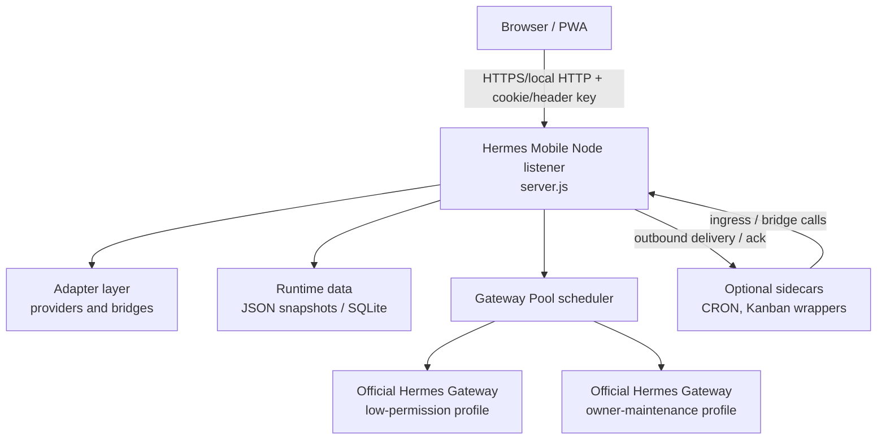
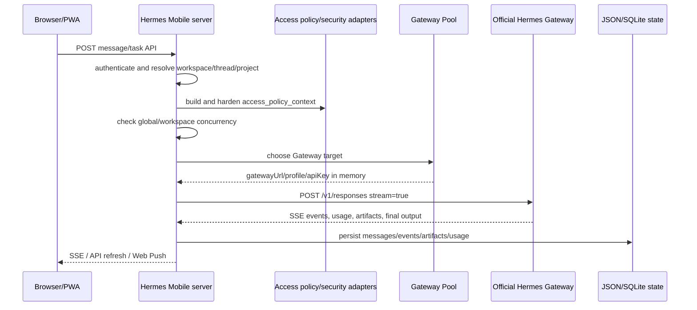

# Hermes Mobile 概要设计

最后更新：2026-05-14

## 1. 文档范围

本文总结 Hermes Mobile 的整体概要设计，面向产品维护、部署、后续重构和跨会话交接。它只描述稳定设计边界和主要运行流程，不记录 Access Key、API key、OAuth token、推送端点、worker manifest secret、生产日志或用户内容。

主要依据：

- `README.md`
- `server.js`
- `public/index.html`
- `docs/ADAPTER_BOUNDARY.md`
- `docs/GATEWAY_POOL_ARCHITECTURE.md`
- `docs/MULTI_TASK_AND_ACCOUNT_PERMISSIONS.zh-CN.md`
- `docs/LOW_GATEWAY_TOOLSET_POLICY.zh-CN.md`
- `docs/SERVICE_LAYER_SQLITE.md`
- `docs/OFFICIAL_HERMES_COMPATIBILITY.md`
- `docs/PROCESS_ISOLATION.md`
- `docs/WEIXIN_INGRESS.md`
- `docs/KANBAN_TODO_INTEGRATION.md`

## 2. 系统定位

Hermes Mobile 是一个移动优先的本地 Web/PWA 产品层，用于让手机或桌面浏览器通过受控 API 使用本地或私有网络中的官方 Hermes Gateway。它不是官方 Hermes dashboard 的替代前端，也不依赖官方 dashboard 的终端/PTY 聊天模型。

核心定位：

- Hermes Mobile 负责用户界面、账号、工作区、权限、队列、通知、文件预览、任务/看板/自动化、外部入口和产品状态。
- 官方 Hermes Gateway 负责模型运行、Agent loop、工具调用、Skill、记忆、会话、压缩、事件、usage 和 artifact 语义。
- Hermes Mobile 不直接调用 OpenAI/Codex 来绕过 Gateway，也不在产品代码中修改官方 Hermes 源码。
- 单 Gateway 是最小安装和回退路径；生产目标是 Hermes Mobile 调度多个官方 Gateway profile 的 Gateway Pool。

## 3. 设计目标与非目标

### 3.1 设计目标

- 提供移动端可用的聊天、话题流、目录、看板、自动化、群聊和设置界面。
- 支持 Owner 与多 workspace 用户，通过 Access Key 做浏览器/API 认证。
- 在 Gateway run 创建前完成工作区 ACL、文件根、共享目录、工具权限和并发限制判断。
- 通过 Gateway Pool 将普通任务路由到低权限 Gateway，将显式 Owner 维护任务路由到 owner-maintenance Gateway。
- 保持官方 Hermes 可升级，产品特性放在 Hermes Mobile core、adapter、脚本和部署配置中。
- 运行数据默认存放在 `HERMES_WEB_DATA_DIR` 下，并可切换到 SQLite 服务层。
- Web Push、SSE、文件预览和 artifact 路由都通过认证 API 重新读取内容，避免在通知或前端 payload 中暴露秘密。

### 3.2 非目标

- 不把普通用户请求直接送到 shell、git、Codex 委托或源码维护工具。
- 不把 worker API key、VAPID private key、OAuth token、Access Key 明文写入状态、日志、浏览器 payload 或公开文档。
- 不把已退役的 Weixin/iLink polling 放回官方 Hermes Gateway 补丁中。
- 不把 runtime 数据、上传文件、日志、`.agent-context` 或本地部署私有路径纳入 public export。

## 4. 总体架构

### 4.1 前端层

前端位于 `public/`，主入口是 `public/index.html` 和 `public/app.js`。主要视图：

- 聊天：单窗口聊天、连续上下文、搜索、附件、停止运行。
- 话题：任务流、话题列表、目录筛选、群聊入口。
- 目录：按 workspace/project/share 展示目录、预览、上传、新建文件夹、删除、共享目录管理。
- 看板：Todo、官方 Kanban lane、故事树、学习计划、阅读模板、正式测评计划、提交/评分/重考流程。
- 自动化：Automation/CRON 列表、详情、输出和 deliverable 预览。
- 管理：Owner Access Key、workspace 管理、runtime Gateway/Web Push 配置、PWA 安装、字体和通知设置、Owner 提权。

前端通过 REST API 获取状态，通过 `/api/events` 接收 SSE 更新，通过 Service Worker 和 Web Push 获取后台通知。PWA 静态版本由 `public/index.html`、`public/service-worker.js` 和 `/api/client-version` 协同检查。

### 4.2 HTTP 服务层

`server.js` 是当前核心 HTTP listener，使用 Node.js 原生 `http.createServer`。它仍然集中承担以下职责：

- 认证、Owner first-run setup、Access Key 登录和 cookie/header key 解析。
- HTTP 路由、API 权限判断、workspace 访问校验。
- thread/message/artifact 状态管理。
- 目录、文件、artifact、自动化输出和 Kanban 输出预览的 ACL 校验。
- Gateway run 创建、SSE 流处理、liveness/stop、usage/artifact 收集。
- Web Push subscription、receipt、delivery summary 和深链。
- 前端静态文件服务。

后续新增部署相关能力时，应优先抽象到 adapter，不应继续把本地账号名、机器路径、外部 connector 细节写入 `server.js` 主流程。

### 4.3 Adapter 层

Adapter 层把产品 core 与部署差异隔离。当前主要 provider：

| 模块 | 主要职责 |
| --- | --- |
| `auth-provider` | Owner key、workspace key、first-run setup、key 轮换/撤销 |
| `workspace-project-provider` | workspace、route map、project catalog 归一化 |
| `access-policy-provider` | 按 workspace/project 构造 `access_policy_context` |
| `security-boundary-provider` | 保护路径、工具集过滤、普通 run 安全加固 |
| `gateway-pool-provider` | Gateway Pool manifest、健康检查、worker 选择、Skill profile 路由 |
| `gateway-runner` | 官方 Gateway HTTP/SSE、stop、liveness、per-run API key |
| `run-concurrency-policy` | 全局和 workspace 级活跃 run 限流 |
| `mobile-sqlite-store` | SQLite schema、JSON 导入、可选运行时状态后端 |
| `todo-provider` / `kanban-provider` | Todo API 兼容层、官方 Kanban bridge、metadata sidecar |
| `automation-provider` | Automation/CRON bridge、输出文件和 deliverable 授权 |
| `shared-directory-provider` | 共享目录、ACL 派生 share、只读写保护 |
| `project-discovery-provider` | 物理目录、远程 `/volume1`、共享 root、project 去重 |
| `filesystem-mount-provider` | Windows/WSL/POSIX 路径转换和 artifact root 允许判断 |
| `runtime-config-provider` | Gateway URL、API key 文件路径、Web Push subject、VAPID 路径 |
| `workspace-bindings-provider` | workspace 可见接口绑定摘要，不暴露秘密 |
| `external-integration-provider` | Owner 外部集成的非秘密展示元数据 |
| `delivery-boundary-provider` | 生成文档交付边界，默认 Markdown，外发时再导出 PDF/Office |
| `bridge-command-provider` | Todo/CRON/Directory/Skill bridge 脚本命令解析 |
| `skill-detail-provider` | Skill detail bridge 调用、超时、JSON 解析和 not-found 映射 |

## 5. 核心运行流程

### 5.1 登录与工作区建立

1. 首次启动时，如果没有 `HERMES_WEB_KEY` 且 Owner key 文件不存在，`/api/public-config` 返回 setup required。
2. 浏览器通过 `/api/setup/owner` 创建 Owner Access Key，明文只显示一次。
3. Owner 登录后可以创建本地 workspace、配置根目录/允许目录/toolsets、生成或撤销 workspace Access Key。
4. 普通 workspace 用户用自己的 key 登录后，只能访问对应 workspace 的 threads、tasks、directories、todos、automations 和共享目录。

### 5.2 聊天/任务 run 生命周期

关键规则：

- 单窗口聊天按同一 task group 串行排队；排队消息升为 active 前重新检查并发和权限。
- `startRunForThread()` 会写入非秘密路由元数据：`gatewayUrl`、`gatewayName`、`gatewayProfile`、`gatewaySource`。
- Gateway API key 只在内存请求中使用，不写入 message、SQLite、state snapshot、前端 payload 或文档。
- stop、liveness 和 stream 后续操作必须回到创建该 run 的同一个 Gateway。
- Gateway `/v1/runs/<id>` 的短暂 404 不能立即视为 stream 死亡；长工具调用期间 SSE 可能仍然有效。

### 5.3 Gateway Pool 与 Owner 提权

Gateway Pool 根据 manifest 和请求上下文选择 worker：

- 普通用户 run 必须选择 `securityLevel=user` 的低权限 worker。
- Owner 的普通聊天/任务也默认使用低权限 worker。
- Owner maintenance worker 只能在显式 Owner 维护模式下使用，并且部署必须启用相关路由。
- 如果普通 run 没有健康的 user worker，应 fail closed，而不是落到高权限 worker。
- Skill 隔离通过 manifest 的 `skillProfile` 和 `skillWorkspaceIds` 完成，Hermes Mobile 只选择 profile，不修改官方 Gateway Skill 机制。

Owner 提权有两种产品入口：

- 侧边栏限时 grant，用于一段时间内的维护请求。
- composer 一次性 token，用于当前消息。

模型侧 permission-boundary Skill 可以输出 `HERMES_PERMISSION_APPROVAL_REQUIRED` 标记；Hermes Mobile 会隐藏该标记并把消息标记为需要 Owner 批准，批准后只重跑那一次维护 run。

### 5.4 目录、文件与 artifact

目录和文件能力围绕 workspace/project/share ACL 设计：

- `/api/projects` 只返回当前用户可见的 project、默认根和共享目录。
- `/api/directories/preview`、`/api/files`、`/api/files/preview` 按 workspace ACL 校验路径。
- 上传和新建目录必须基于当前 workspace/thread/project 解析目标路径。
- 删除是显式操作，根目录、同步根、下载根、allowed-root 根和受保护路径不可被普通请求删除。
- Artifact 预览必须通过 thread/message/group ACL 校验，不直接暴露裸路径作为权限。

### 5.5 Todo、Kanban、学习计划与测评

Hermes Mobile 的 Todo 表面兼容 `/api/todos`，后端可选：

- local JSON/SQLite：适合干净安装和本地产品运行。
- official Hermes Kanban：设置 `HERMES_WEB_TODO_BACKEND=kanban` 后，每个 workspace 映射到 `workspace-<workspaceId>` board。

在 Kanban 模式下：

- 官方 Kanban 是任务生命周期的基础执行内核。
- Hermes Mobile 负责浏览器认证、workspace ACL、移动端渲染、Web Push、due/reminder metadata 和学习/测评工作流。
- 学习计划统一为 `study-plan`，阅读只是其中一个 template。
- 正式测评计划为 `assessment-plan`，通过 Hermes Mobile 的测评状态、答题、评分和重考规则判断是否完成，而不是简单信任 raw Kanban `done`。
- story tree、archive、revision、输出展示和 blocked/manual 状态由移动端工作流裁剪成用户可读表面。

### 5.6 Automation/CRON

Automation provider 把 CRON bridge 的部署细节隔离起来：

- `/api/automations` 提供列表、创建、修改、暂停/恢复等产品 API。
- 输出和 deliverable 预览必须确认文件来自该自动化授权输出或交付路径。
- Web Push 可以对自动化结果和 deliverable 做通知，但通知 payload 不包含敏感路径或秘密。

### 5.7 Web Push 与实时刷新

Hermes Mobile 使用两类实时通道：

- `/api/events` SSE：前端已打开时收到 thread/message/run/push 状态变化。
- Web Push：前端关闭或后台时发送通知、receipt 和深链。

设计要求：

- Push payload 只携带摘要和认证后可重新读取的定位信息。
- 真实内容、artifact、文件和 usage 仍通过认证 API 读取。
- Push subscription、receipt、delivery summary 可进入 SQLite 或 JSON 状态。

### 5.8 已退役的 Weixin/iLink 外部入口

Weixin/iLink ingress、outbound delivery、手动转发和专用聊天窗口已于
2026-06-28 从 Home AI 运行面移除。Home AI 聊天、群聊、目录、原生分享、
Action Inbox、Web Push/native notification 和插件通知是维护中的入口。

保留 `weixin_*` 命名仅表示历史 workspace id，不表示 Weixin transport
仍然可用。未来不得把旧 `/api/ingress/weixin/*` 或 `/api/weixin/*`
路由、sidecar 脚本、heartbeat smoke 作为有效部署契约恢复。

## 6. 数据与配置设计

### 6.1 运行数据目录

核心运行目录由 `HERMES_WEB_DATA_DIR` 指定。典型数据包括：

- `state.json`：thread、message、artifact、push 等 JSON snapshot。
- `workspaces.json`：本地 Owner 管理的 workspace 记录。
- `access-keys.json`：workspace Access Key hash store。
- `runtime-config.json`：Gateway URL、API key 文件路径、Web Push subject、VAPID 文件路径等非秘密配置。
- `shared-directories.json`：显式共享目录记录。
- `kanban-todo-meta.json`、`kanban-card-list-cache.json`、`kanban-case-shares.json`：Kanban 兼容和学习/测评工作流 sidecar 状态。
- `artifacts/`、`uploads/`、`drive/`：生成物、上传缓存和默认用户文件根。

### 6.2 SQLite 服务层

当 `HERMES_WEB_SERVICE_STORE=sqlite` 且设置 `HERMES_WEB_DB_PATH` 时，Hermes Mobile 可使用 SQLite 作为运行状态后端。当前 schema 覆盖：

- workspaces
- access-key hashes
- threads
- messages
- artifacts
- Web Push subscriptions/receipts/deliveries
- shared directories
- Todo items
- Automation jobs
- audit events
- metadata 和 schema migrations

SQLite runtime 写入成功后仍保留 `state.json` snapshot，用于回滚和检查。迁移脚本只输出计数、hash、文件大小、warning 和 integrity 状态，不输出 raw key、push endpoint、消息正文或私密内容。

### 6.3 配置边界

重要配置通过环境变量或 Owner runtime UI 提供，包括：

- listener：`HERMES_WEB_HOST`、`HERMES_WEB_PORT`、`HERMES_WEB_DATA_DIR`
- Gateway：`HERMES_WEB_HERMES_API_BASE`、`HERMES_WEB_HERMES_API_KEY_PATH`
- Gateway Pool：`HERMES_WEB_GATEWAY_POOL_ENABLED`、`HERMES_WEB_GATEWAY_POOL_MANIFEST`
- 并发：`HERMES_WEB_MAX_ACTIVE_RUNS`、`HERMES_WEB_MAX_ACTIVE_RUNS_PER_WORKSPACE`
- Skill routing：`HERMES_MOBILE_GATEWAY_SKILL_PROFILE_ROUTING`
- SQLite：`HERMES_WEB_SERVICE_STORE`、`HERMES_WEB_DB_PATH`
- Web Push：`HERMES_WEB_VAPID_PATH`、`WEB_PUSH_VAPID_*`
- 安全边界：`HERMES_MOBILE_SECURITY_PROTECTED_ROOTS`、`HERMES_MOBILE_SECURITY_ALLOWED_EXCEPTIONS`

文档和源码只能记录配置名、示例路径和安全原则，不能记录真实秘密值。

## 7. 权限与安全设计

### 7.1 账号模型

- Owner：安装者/管理员。可管理 workspace、Access Key、runtime config、Gateway Pool 状态、Owner 提权。
- Workspace 用户：只拥有一个 workspace 的浏览器/API 权限。
- Group chat：显式成员例外，成员可读写 group thread，但 artifact 和交付仍按 group ACL 校验。
- Shared directory：显式共享例外；只读共享必须阻止写操作。

### 7.2 普通低权限 Gateway 工具策略

低权限不是历史上的极窄白名单，而是当前账号/当前 workspace/当前授权 roots 内的普通业务能力。默认可包含：

- `web`、`search`、`http`、`weather`
- `browser`
- `file`
- `vision`、`video`
- `image_gen`
- `messaging`、`tts`
- `skills`
- `todo`、`kanban`、`cronjob`
- `memory`、`session_search`、`clarify`

默认禁止：

- `terminal`、`process`、`shell`、`cmd`、`powershell`、`bash`
- `git`、`source`、`developer`、`debug`
- `code_execution`、`python`
- `codex`、`delegation`
- `computer_use`、`homeassistant`
- broad `mcp`、RL/MOA fanout 等跨边界能力

权限必须同时落在 Hermes Mobile 的 `access_policy_context`、Gateway profile toolsets、profile-local plugin、模型侧 permission-boundary Skill 和 OS/process isolation 上。只改其中一层不构成完整权限边界。

### 7.3 保护路径

默认受保护对象包括：

- Hermes Mobile 源码和静态目录。
- config、runtime config、Access Key store、SQLite/JSON state、shared-directory store、VAPID、ingress key、Gateway API key。
- worker manifest、Hermes home、OAuth/token 文件、update sandbox、operator-only 目录。

安全例外应限于用户数据、uploads、artifacts、group deliveries、Automation output/run-log 等窄路径。生产不应把用户 home、`Documents`、源码父目录或整个 runtime data root 作为模型可访问根。

### 7.4 进程隔离

建议生产形态是源码、runtime package、mutable data 三者分离：

- 源码 checkout：只给 operator/developer 读写。
- runtime package：干净导出或 release artifact，给 Hermes Mobile service account 运行。
- mutable data：service account 可写。
- official Gateway profiles：使用独立低权限 worker/profile，并只接收 Hermes Mobile 每次 run 的 access policy。

Windows 参考布局使用 `C:\ProgramData\HermesMobile\app`、`data`、`logs` 和专用 `HermesMobileWorker` 账号；Linux/macOS 采用类似的系统用户和系统服务边界。

## 8. API 分组

主要 API 面按职责分组：

- Setup/auth：`/api/public-config`、`/api/setup/status`、`/api/setup/owner`、`/api/login`
- 状态和配置：`/api/status`、`/api/runtime-config`、`/api/client-version`、`/api/app-update/*`
- Owner 权限：`/api/owner-elevation`、`/api/access-keys`、`/api/workspaces`
- 实时和聊天：`/api/events`、`/api/threads`、`/api/single-window`
- 目录和文件：`/api/projects`、`/api/directories/*`、`/api/files`、`/api/files/preview`
- Push：`/api/push/*`
- Todo/Kanban：`/api/todos`、`/api/kanban/cards*`
- Automation：`/api/automations*`
- Skill detail：`/api/skills/detail`

所有用户可见 API 都必须在服务端重新校验认证、workspace、thread/group、artifact 或文件路径权限，不能依赖前端隐藏控件作为边界。

## 9. 部署形态

### 9.1 最小单 Gateway

适合本地开发、UI smoke 或已有一个可达 Gateway 的轻量部署：

- Node.js `>=22`
- Python `>=3.12`
- 一个 Hermes Gateway API base
- `HERMES_WEB_HERMES_API_BASE`
- `HERMES_WEB_HERMES_API_KEY_PATH`
- `HERMES_WEB_AUTH_KEY_PATH`

这种模式能登录和运行基础功能，但不等同于参考生产 worker pool。

### 9.2 Gateway Pool 生产形态

适合多账号、多 profile、低权限 worker 和 Owner maintenance 分离：

- Hermes Mobile listener 运行在低权限服务账号下。
- 多个 official Hermes Gateway profile 作为 worker。
- worker manifest 声明 `securityLevel`、`allowedWorkspaceIds`、`skillProfile`、`skillWorkspaceIds`、health/API 连接信息。
- 普通 run 走 `securityLevel=user`。
- 显式 Owner 维护 run 才走 `securityLevel=owner-maintenance`。
- Gateway Pool 启动和低权限 profile 配置通过部署脚本完成，不修改官方 Hermes 源码。

### 9.3 Public export

Public release 从干净 export 生成，应通过 privacy scan。不得包含：

- `.agent-context`
- runtime DB、state、logs、uploads、backups
- Access Key、Gateway API key、VAPID private key、OAuth token、push endpoint
- 含 secret 的 worker manifest
- 私有 clone URL、本地绝对路径、生产事故复盘或 operator 指令

## 10. 测试与验收

代码级验证入口：

- `npm run check`
- `npm test`
- `npm run productization:check`
- `npm run privacy:scan`
- `node scripts/gateway-tool-schema-smoke.js`
- `node scripts/gateway-pool-production-smoke.js`
- `node scripts/official-hermes-compat-smoke.js`

概要验收点：

- Owner first-run setup 创建 key 且明文只显示一次。
- Owner 可创建 workspace、生成/revoke workspace key。
- 普通用户只能访问自己的 workspace 数据。
- 普通 run 选择低权限 Gateway；无健康 user worker 时 fail closed。
- Owner maintenance 只有显式授权时才选择高权限 worker。
- 普通 run 的 `access_policy_context` 不包含源码、密钥、worker manifest、其他用户根目录或 operator home。
- 文件、artifact、automation deliverable、shared directory 均通过 ACL。
- Web Push 不携带秘密或裸路径。
- SQLite 模式写入成功后仍可通过 JSON snapshot 回滚。
- Public export 通过隐私扫描。

## 11. 当前架构状态与后续方向

当前架构已经形成清晰边界：

- Hermes Mobile 是产品调度和权限层。
- 官方 Hermes Gateway 是执行内核。
- Adapter 层覆盖大部分部署差异。
- SQLite 服务层可作为 JSON state 的迁移和运行时后端。
- Kanban、Automation、外部 connector 均以 sidecar 或 adapter 形态接入。

仍需持续控制的方向：

- `server.js` 仍是较大的路由和编排文件；新增功能应优先进入 provider/adapter，逐步减少主文件耦合。
- 低权限工具能力必须用真实 worker schema smoke 验证，不能只看配置或源码。
- 浏览器自动化等能力还依赖 worker runtime 中的实际依赖；缺依赖时应描述为运行时能力未就绪，而不是权限已开放。
- 生产部署应继续保持源码、runtime package、mutable data、Gateway worker profile 的 OS 级隔离。
- Public export 应继续以隐私扫描和干净导出为发布前置条件。
