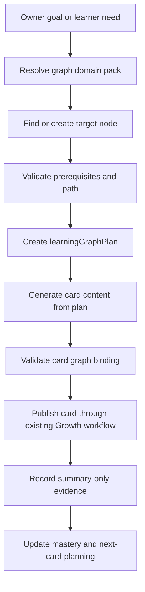

# Growth Knowledge Graph Design

Last updated: 2026-05-27.

## Design Goal

The graph-guided Growth design makes the model write inside a stable learning
structure:

1. resolve the learning target;
2. validate prerequisites;
3. choose a path and card role;
4. generate a card from the plan;
5. bind learner evidence back to the node.

This reduces free-form AI drift while keeping the card content model-authored.

## Authoring Flow



## Planning Contract

`learningGraphPlan` is the required bridge between graph and card generation.

Required fields:

- `learningGraphPlanId`
- `learnerId`
- `programId`
- `domain`
- `targetNodeId`
- `prerequisiteNodeIds`
- `pathNodeIds`
- `cardSequence`
- `sourceBasis`
- `privacyClass`

Optional fields:

- `temporaryNode`
- `assessmentCoverage`
- `difficultyBand`
- `repairReason`
- `ownerReviewRequired`
- `sourceImportId`

## Card Binding Contract

Every new formal card must persist a graph binding:

```js
{
  cardId: "ltask_...",
  learningGraphPlanId: "lgp_...",
  cardRole: "teaching",
  targetNodeIds: ["kg_ratio_intro"],
  prerequisiteNodeIds: ["kg_fraction_meaning"],
  assessmentCoverageNodeIds: [],
  evidenceRequired: ["explain_ratio_comparison"],
  difficultyBand: "foundation"
}
```

Role-specific rules:

- `teaching`: one focused target node unless the plan explicitly creates a
  bridge node.
- `practice`: one target node or a small adjacent set.
- `integration_practice`: two or more related nodes with an explicit integration
  reason.
- `stage_assessment`: one or more coverage nodes and an assessment objective.

## Temporary Nodes

Temporary nodes allow progress before a complete graph exists.

Rules:

- id prefix should identify the node as temporary, for example `tmpkg_`;
- the node must still declare outcomes, prerequisites, evidence, and domain;
- the node must not store raw source text or raw model output;
- temporary nodes should be reviewable and promotable to a domain pack later.

## External Seed Mapping

External K12 seed structures can be converted into native graph records.

For a TeachAny-like seed:

| External concept | Hermes native concept |
| --- | --- |
| curriculum tree file | `learning_graph_domain_packs` + `learning_graph_nodes` |
| source node id/path | `source.kind`, `source.ref` |
| knowledge-point detail | node outcomes, misconception labels, resources summary |
| tree parent/child | `contains` or `sequence_hint` edge |
| prerequisite metadata | `prerequisite` edge |
| courseware examples | optional source refs, not card runtime dependency |

The converter must not make Hermes card runtime depend on external path layout.

For a public curriculum foundation seed:

| External concept | Hermes native concept |
| --- | --- |
| source manifest | `learning_graph_imports` provenance and dry-run report |
| public subject page | source reference and bounded subject metadata |
| public syllabus/specification PDF | source reference, hash, stage, subject, and extracted summary nodes |
| downloaded local file path | import-time input only, never runtime card dependency |
| restricted or paid material | rejected source with a bounded rejection reason |

The graph pack must be learner-level aware. A Primary / Key Stage 1-2 pack for a
Year 2 learner should not import IGCSE or A Level nodes as direct current
targets; those should remain distant destination metadata until a bridge plan
explicitly activates them.

## Beyond K12 Design

The same schema supports non-K12 domains by changing `domain`, `levelScale`, and
node types.

Examples:

### Programming

- `domain`: `programming`
- `nodeType`: `concept`, `procedure`, `debugging_skill`, `project`
- `levelScale`: `beginner`, `intermediate`, `advanced`
- evidence: runnable code, explanation, debugging trace summary

### English

- `domain`: `english`
- `levelScale`: CEFR or internal skill band
- `nodeType`: vocabulary skill, grammar pattern, reading strategy, speaking task
- evidence: short response summary, pronunciation score, rewrite improvement

### Personal Knowledge Workflow

- `domain`: `wardrobe`, `finance`, `health`, or another Owner-approved pack
- `nodeType`: concept, routine, decision rule, review checklist
- evidence: bounded completion metadata or review summary

## Model Prompt Contract

Card-generation prompts should receive only:

- current graph plan;
- bounded learner mastery summary;
- bounded recent experience signals;
- card role;
- safe source summaries;
- required output schema.

They must not receive:

- raw full learner answers unless the specific evaluation flow requires it;
- full transcripts;
- full source books or long private materials;
- raw prior prompts or model responses.

## Validation Rules

The graph validator must reject:

- missing `targetNodeId`;
- missing prerequisite node refs;
- cyclic prerequisite graph;
- stage assessment without `assessmentCoverageNodeIds`;
- card binding whose role does not match the planned role;
- graph plan containing raw prompt/model-response markers;
- graph plan containing full learner private content.

## UI Projection

Initial UI does not need a full graph browser.

Minimum projection:

- compact card path label;
- current node title;
- prerequisite chips if useful;
- reason for the next card;
- stage assessment coverage summary.

Projection remains summary-only and should not expose source file paths or raw
private source material.

## Feedback Loop

Learner feedback updates planning evidence:

- `too_easy`: next card can increase difficulty or unlock assessment readiness;
- `right_level`: reinforces current band;
- `too_hard`: queues prerequisite repair or easier teaching card;
- `not_learned`: creates prerequisite-gap evidence;
- `confusing`: asks planner to change explanation lens or add scaffold.

These signals do not directly become formal mastery failures.
