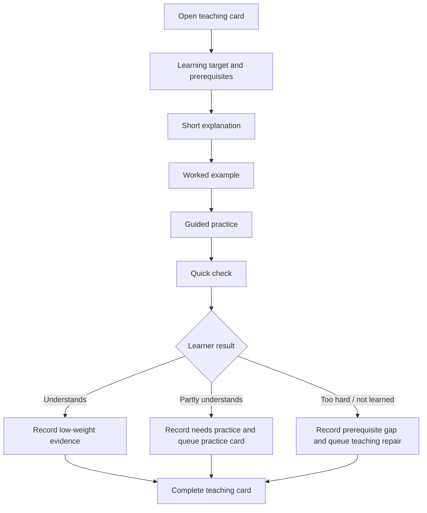
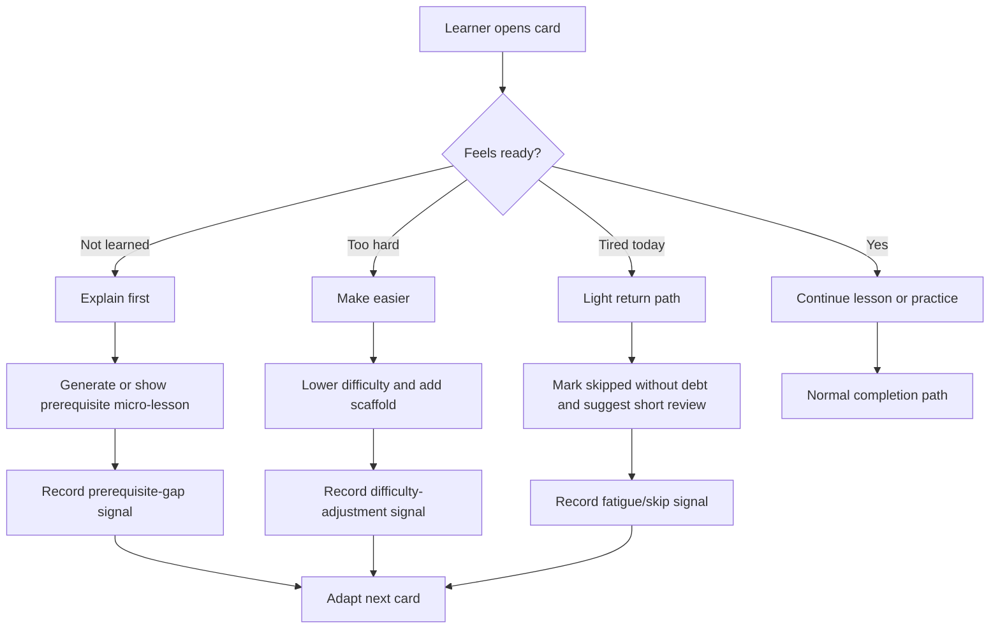
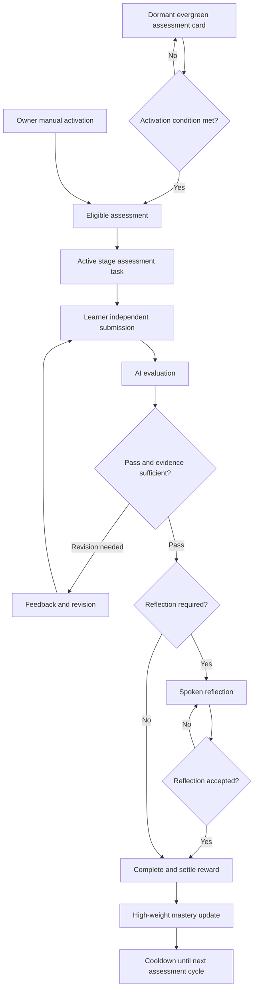
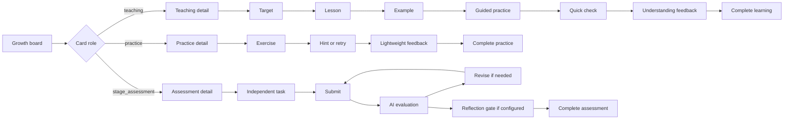

# Growth Teaching Card And Stage Assessment Flow

## Goal

Growth cards must teach before they test. A learner can fail to answer a Python or Science card because the card is above the learner's independent level, not because the learner has weak ability. The product should distinguish:

- new or partially learned knowledge that needs instruction;
- practice that checks whether the instruction made sense;
- formal ability assessment that should update mastery with higher confidence.

The durable rule is:

> Ordinary cards teach and practice. Stage assessment evergreen cards activate only when conditions are met or Owner activates them manually, and those assessments carry the formal mastery weight.

Graph-guided planning is the pre-authoring layer for this flow. New formal
model-generated cards should start from a validated `learningGraphPlan` that
declares the target node, prerequisites, card role, evidence requirements, and
assessment coverage when applicable. The detailed graph contract is defined in
`docs\IMPLEMENTATION_NOTES\growth-knowledge-graph-requirements.md`,
`docs\IMPLEMENTATION_NOTES\growth-knowledge-graph-architecture.md`,
`docs\IMPLEMENTATION_NOTES\growth-knowledge-graph-design.md`, and
`docs\IMPLEMENTATION_NOTES\growth-knowledge-graph-implementation.md`.

## Current Problem

The existing card flow is assessment-oriented:

1. learner submits;
2. AI evaluates;
3. learner revises and resubmits if needed;
4. AI evaluates again;
5. spoken reflection may be required;
6. final completion and reward settlement happen only after all gates pass.

That flow is still appropriate for formal assessment cards, but it is too heavy for every ordinary learning card. It also creates bad pedagogy for new topics: if a card asks for independent work before teaching the prerequisite knowledge, the result should be recorded as `prerequisite_gap` or `too_advanced`, not as a simple mastery failure.

## Experience Principles

The system goal is not only task completion. It should build a sustainable, low-pressure learning loop where the learner can recover after difficulty and gradually feel capable.

Product principles:

- Ordinary cards should feel like a short interaction, not homework debt or a daily exam.
- A normal teaching card should usually fit in 10-15 minutes so there is enough room for explanation, example, guided practice, and a small check.
- The learner should see many small wins and occasional challenges, not repeated high-stakes failure.
- The learner must have safe exits: `too_hard`, `not_learned`, `explain_first`, `skip_today`, or `make_easier`.
- Those exits should reduce difficulty or repair prerequisites; they should not directly punish mastery or rewards.
- If a learner repeatedly avoids, abandons, or reports cards as too hard, the system should adapt the card strategy before increasing pressure.
- Coins are a secondary reinforcement only. The primary motivators should be visible progress, choice, small creations, and feeling that the next card is within reach.

Target difficulty for ordinary cards should be "mostly doable after teaching". As an initial heuristic, normal teaching/practice cards should aim for roughly 70-85% successful completion after the lesson and hints. Stage assessments can be more demanding, should usually take about 25-30 minutes, and should activate only when evidence suggests the learner is ready, Owner explicitly chooses the challenge, or the executor starts a challenge for their own capability cluster.

Reward defaults are part of the V1 product rule: ordinary teaching/practice/integration cards default to `100` coins, and stage assessment cards default to `300` coins. Backend reward policy can override these values.

## Learning Experience Signals

Mastery profile should be complemented by learning-experience signals. These signals affect card generation and scheduling, but they are not formal mastery failures by themselves.

Suggested signals:

- `too_hard`: learner says the card is above current ability.
- `not_learned`: learner says the prerequisite or concept has not been learned.
- `explain_first`: learner requests teaching before attempting.
- `low_confidence`: learner completes but reports uncertainty.
- `abandoned`: learner opens but does not complete after a reasonable window.
- `fatigue`: repeated short sessions end early or many cards are skipped.
- `interest`: learner chooses or positively responds to a topic/project style.
- `flow`: learner completes a card smoothly with little friction.

These signals should feed:

- next-card difficulty;
- prerequisite repair generation;
- whether to activate a stage assessment;
- daily card volume;
- whether to offer project-style or choice-based cards.

Do not store full learner text in these signals. Store bounded enum values, timestamps, card ids, capability ids, and short safe summaries.

## Motivation Model

The reward model should not depend only on coins.

Use multiple reinforcement types:

- progress evidence: "last week you needed hints; now you can do this step";
- small creations: Python mini tools, tiny games, drawings, charts, science explanations, or experiments;
- choice: learner can choose between two safe topics or formats;
- streak recovery: missed days do not create debt; the next card can be lighter;
- visible capability path: show a small map of what the learner is building toward;
- parent-visible evidence: Owner sees progress and friction without needing every card to be a formal test.

Daily scheduling should avoid backlog pressure. If a learner misses a day, do not simply stack unfinished cards. Prefer a lightweight return card, review card, or one short teaching card.

## Card Roles

| Role | Primary Purpose | Learner Experience | Completion Policy | Mastery Weight | Default Coins |
| --- | --- | --- | --- | --- | ---: |
| `teaching` | Teach one focused concept or skill | Read short explanation, inspect example, follow guided practice, complete a small check | Complete after guided check plus learner understanding feedback; no formal reflection by default | Low evidence, high planning value | 100 |
| `practice` | Reinforce recently taught material | Do one or more small exercises with hints or retry | Complete after practice response and lightweight feedback | Medium evidence | 100 |
| `integration_practice` | Combine several recently taught concepts | Apply two or more linked skills in one task | May use AI feedback; reflection optional | Medium evidence | 100 |
| `stage_assessment` | Formal ability measurement | Independent task, AI evaluation, revision if needed, spoken reflection when configured | Existing submit/evaluate/revise/reflect/complete flow | High evidence | 300 |

Teaching cards and practice cards may still call AI for coaching, but their output should be framed as learning feedback, not exam grading.

## Ordinary Teaching Card Flow

Teaching cards should avoid the old "submit first" framing. The UI should guide the learner through a short lesson and only then ask for a small check.

### Teaching Card Sections

Each teaching card should project these sections to the frontend:

- `learningTarget`: what this card teaches.
- `whyItMatters`: short learner-facing context.
- `prerequisites`: what the learner is expected to already know; if missing, the card can route to a prerequisite repair.
- `microLesson`: concise explanation.
- `workedExample`: one example with visible reasoning or code walkthrough.
- `guidedPractice`: scaffolded activity, such as fill-in, choose, explain, or modify.
- `quickCheck`: one small independent check aligned with the lesson.
- `understandingFeedback`: learner or evaluator summary: `understood`, `partial`, `needs_practice`, `prerequisite_gap`, `too_advanced`.

Do not require spoken reflection on ordinary teaching cards by default. Reflection remains available for stage assessments or higher-stakes tasks.

### Learner Pressure Relief Flow

Teaching cards need a first-class path for frustration or missing prerequisites.

This flow is important for reducing cheating pressure. If the only available action is "submit an answer", a learner who is overwhelmed may guess, copy, or avoid the system. If the learner can safely say "I have not learned this", the system can repair the path.

## Stage Assessment Evergreen Card

The stage assessment card is an evergreen card. It can stay dormant and only become active when the learner has enough recent teaching/practice evidence or when Owner manually activates it.

### Activation Conditions

Activation should be condition-based, not only calendar-based. Suggested triggers:

- enough ordinary cards completed for a subject/capability cluster, such as 4-8 cards;
- enough time has passed since the last formal assessment, such as 5-10 days;
- recent cards show repeated `understood` or `needs_practice` evidence and the system needs independent confirmation;
- mastery profile has low-confidence or stale evidence for an active capability;
- a parent/Owner manually activates the card;
- the executor starts a challenge because they feel ready for a formal check;
- the learner repeatedly reports `too_advanced`, which should trigger a prerequisite assessment or repair assessment rather than a normal advancement test.

Use cooldowns and minimum evidence thresholds so the learner is not tested after every card.

Stage assessment should be framed as a challenge/checkpoint, not as daily homework. It should remain hidden or low-prominence while dormant. When eligible, the UI can say "ready for a small checkpoint". Owner can manually activate it, and the executor can start a challenge for their own available capability cluster when cooldown and safety policy allow it.

## Frontend Flow Plan

The Growth task detail frontend should branch by `cardRole`.

### Frontend States

Proposed frontend states for teaching cards:

- `lesson`: show target, prerequisite chips, explanation, and example.
- `guided_practice`: show scaffolded activity and hints.
- `quick_check`: collect a small response.
- `feedback`: show lightweight feedback and next recommendation.
- `complete`: show summary evidence and next action.

Existing assessment states remain for `stage_assessment`:

- `draft`
- `submitted`
- `pending_evaluation`
- `draft_feedback`
- `revision_required`
- `spoken_reflection_required`
- `completed`

### UI Rules

- Show `教学`, `练习`, or `测评` as a compact card role badge.
- On teaching cards, avoid exam language such as "正式评分" unless the card is an assessment.
- Show a `太难 / 没学过` feedback action. That action should not penalize mastery directly; it should create prerequisite-gap evidence.
- Keep teaching content in the source card/detail projection. Do not copy full learner responses, prompts, or answer keys into mastery summaries, Action Inbox, handoffs, or docs.
- The primary action button should match the current teaching step:
  - `开始学习`
  - `看示例`
  - `开始跟练`
  - `做小检查`
  - `完成学习`
- Stage assessment cards may reuse the current submit/evaluate/revise/reflect UI with clearer `阶段测评` labeling.

## Data And API Proposal

Add or project these fields on `learning_task_cards` and public card detail responses:

- `cardRole`: `teaching`, `practice`, `integration_practice`, or `stage_assessment`.
- `capabilityClusterId`: stable capability cluster covered by this card.
- `teachingFlow`: structured summary for lesson/example/guided practice/quick check.
- `completionPolicy`: `teaching_check`, `practice_feedback`, or `formal_assessment`.
- `masteryEvidenceWeight`: `low`, `medium`, or `high`.
- `stageAssessmentCycleId`: set when a card is linked to an assessment cycle.
- `activationState`: `dormant`, `eligible`, `active`, `completed`, or `cooldown` for stage assessment cards.
- `activationReason`: summary-only reason, such as `enough_recent_practice`, `stale_mastery_evidence`, or `owner_manual`.
- `experienceSignals`: bounded recent signals such as `too_hard`, `not_learned`, `low_confidence`, `abandoned`, `fatigue`, `interest`, or `flow`.
- `pressureLevel`: `low`, `normal`, or `high`, derived from friction signals and recent assessment load.
- `learnerChoice`: optional safe topic/format choice used for interest-driven card generation.

Possible new service responsibilities:

- `learning-growth-card-role-service`: normalizes role, completion policy, and evidence weight.
- `learning-growth-stage-assessment-service`: owns stage assessment eligibility, manual activation, cooldown, and card linkage.
- `learning-growth-experience-signal-service`: records low-pressure experience signals and provides summary inputs for card generation and scheduling.
- Existing `learning-growth-task-interaction-state-service`: should project different next actions for teaching/practice/assessment roles.
- Existing `learning-growth-mastery-profile-service`: should treat teaching evidence as low-weight support and stage assessment evidence as high-weight mastery evidence.
- Existing JIT card generation should generate teaching blocks for new or weak concepts instead of immediately generating independent tests.

## Model Generation Contract

Do not rely on the model to infer this design from prose alone. The model should receive a structured contract, and the product should validate the output before publishing a card.

Required model input:

- learner age/level summary;
- active subject and capability ids;
- recent mastery evidence summary;
- recent experience signals, such as too-hard or fatigue counts;
- allowed `cardRole` and `completionPolicy`;
- target difficulty band;
- known prerequisites and whether they have evidence;
- whether this card is teaching, practice, integration, or stage assessment.

Required model output schema for teaching/practice cards:

- `cardRole`
- `teachingFlow.learningTarget`
- `teachingFlow.prerequisites`
- `teachingFlow.microLesson`
- `teachingFlow.workedExample`
- `teachingFlow.guidedPractice`
- `teachingFlow.quickCheck`
- `expectedTimeMinutes`
- `difficultyBasis`
- `supportLevel`
- `teachingFlow.tooHardFallback`
- `evidenceToRecord`

Validation rules:

- Teaching cards must include lesson, example, guided practice, and quick check.
- Teaching cards must not use formal assessment gates or exam wording.
- Quick checks must be answerable from the lesson and example.
- If prerequisites are missing or uncertain, the card must be a teaching or repair card, not a stage assessment.
- Expected time for ordinary cards should normally stay within 10-15 minutes.
- The generated content must not include raw prompts, hidden answer keys in public projections, or unsupported claims about mastery.
- In production, ordinary teaching/practice/integration cards must be authored through model output. If `requireModel=true` and the JIT model response omits `teachingFlow`, publishing fails closed rather than showing a locally fabricated lesson as if it were model-generated.
- If schema validation fails, regenerate once with explicit errors; if it fails again, fall back to a deterministic repair card or require Owner review.

This makes the model an author within a constrained product workflow, not the owner of the pedagogy policy.

## Implementation Spec

The code-generation-ready implementation breakdown is in `docs/IMPLEMENTATION_NOTES/growth-teaching-card-implementation.md`. That document defines the service slices, metadata fields, API routes, frontend functions, validation rules, tests, rollout plan, and acceptance criteria that should be followed when this design moves from documentation to code.

## Implementation Phases

### Phase 1: Contracts And Projection

- Add role/completion/evidence fields to card contracts and board projection.
- Keep existing cards defaulted to `stage_assessment` or `practice` based on current behavior, so no migration breaks active cards.
- Add tests for role projection and interaction-state next actions.

### Phase 2: Teaching Card Generation

- Extend card generation schema to include learning target, prerequisite summary, micro lesson, example, guided practice, quick check, and difficulty basis.
- Default new/uncertain capabilities to `teaching` instead of formal assessment.
- Add guardrails: if the model cannot identify taught prerequisites, generate a teaching repair card rather than an independent task.
- Add schema validation and rejection reasons so invalid model output cannot publish a high-pressure or unsupported card.

### Phase 3: Teaching Completion Path

- Add a lightweight completion route or extend existing submission service with `completionPolicy=teaching_check`.
- Persist summary-only understanding feedback and low-weight evidence.
- Do not trigger reward settlement or formal completion notification until the teaching completion policy is satisfied.

### Phase 4: Stage Assessment Evergreen Card

- Add stage assessment cycle service.
- Compute eligibility from recent teaching/practice evidence, elapsed time/cooldown, mastery confidence, and Owner manual activation.
- Project dormant/eligible/active state to the Growth board.
- Add Owner action to manually activate an assessment cycle.

### Phase 4b: Experience Signals And Pressure Control

- Add bounded experience-signal persistence.
- Project friction summaries to next-card strategy.
- Add daily scheduling policy that avoids backlog debt after missed days.
- Add completion-page difficulty feedback actions to the frontend and route them into next-card strategy or prerequisite repair. Do not show the difficulty feedback row at the bottom of every teaching step.

### Phase 5: Frontend

- Split Growth detail rendering by `cardRole`.
- Add stepper/segmented flow for teaching cards.
- Add compact role badges and completion-page difficulty feedback action.
- Keep assessment cards on the existing submit/evaluate/revise/reflect flow with clearer labeling.
- Add focused UI tests for role badges, teaching flow sections, completion-only difficulty feedback, and stage assessment activation actions.

## Validation Plan

- `node tests\learning-growth-task-interaction-state-service.test.js`
- `node tests\learning-growth-mastery-profile-service.test.js`
- `node tests\learning-growth-submission-service.test.js`
- `node tests\learning-growth-board-projection-service.test.js`
- `node tests\app-learning-growth-ui.test.js`
- `node tests\task-list-ui.test.js`
- `node tests\architecture-refactor-boundary.test.js`
- `git diff --check`

## Open Decisions

- Exact threshold for stage assessment activation should start configurable. Suggested initial defaults: minimum 4 recent ordinary cards, minimum 5 days since last formal assessment, Owner manual activation allowed, and executor challenge activation allowed for the executor's own workspace when cooldown/safety policy permits.
- V1 reward defaults are fixed: ordinary teaching/practice/integration cards default to `100` coins and stage assessment cards default to `300` coins, with backend policy override.
- Whether quick checks are locally evaluated or AI-coached can vary by subject. Python and Science should support AI coaching because learner misconceptions are often explanatory, not just right/wrong.
